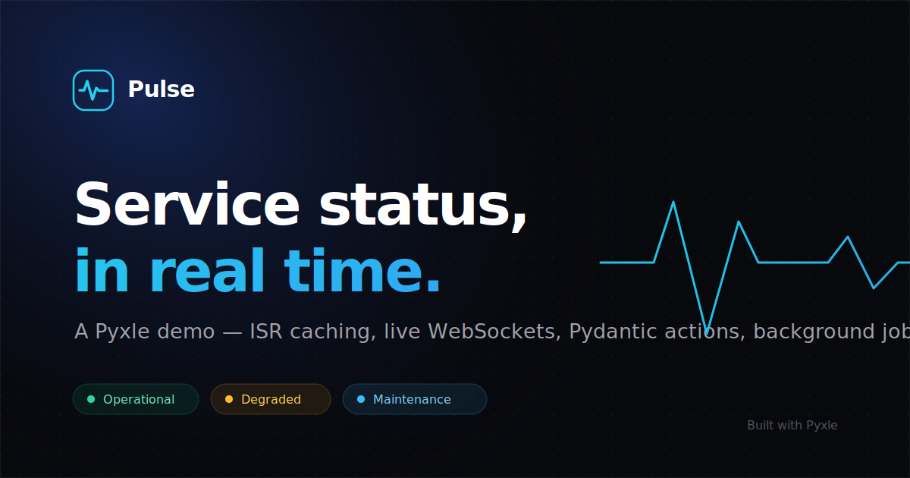

# Pulse — a Pyxle reference app

**Pulse** is a fictional service-status page, built to exercise *every* feature
[Pyxle](https://pyxle.dev) ships. Python loaders and React UI live in the same
`.pyxl` file, server-rendered and hydrated — a status page, a live incident war
room, a validated report form, and a "how it works" tour, in ~1,000 lines.

> A demo, with fictional data that reseeds itself on first boot.



---

## Run it

```bash
# from the repo root, with the shared venv active
pip install -r requirements.txt          # pyxle-framework[pydantic] + pyxle-db
pyxle dev                                 # http://127.0.0.1:3005
```

The pyxle-db plugin opens `data/pulse.db` and applies `migrations/` on first
boot, then `db.ensure_seeded()` fills it with realistic incidents and 90 days of
uptime. Delete `data/pulse.db` to start fresh.

```bash
pyxle build --static && pyxle serve       # production: prerender + serve
pyxle openapi --title "Pulse API"         # OpenAPI 3.1 from the @action models
```

### Production environment

pyxle-auth runs in its **strict** posture by default (Secure cookies, argon
floors, a real signing secret required) — local dev relaxes it via the
committed `.env.development` (`PYXLE_AUTH_STRICT=false`). In production set on
the host:

- `PYXLE_SECRET_KEY` — **required** in strict mode; signs the session/state
  cookies. Boot aborts without it.

The Prometheus metrics endpoint at `/api/__pulse/metrics` is intentionally open
(this is a showcase); add `observability.metricsEndpointToken` to bearer-guard
it if deployed somewhere it shouldn't be public.

---

## What it demonstrates

| Surface | Pyxle features |
|---|---|
| [`pages/index.pyxl`](pages/index.pyxl) — **Status** | `@server` loader, **ISR caching** (`{data, revalidate}`), `<Head>`, `<ClientOnly>`, `<Link>` |
| [`pages/incidents/[id].pyxl`](pages/incidents/[id].pyxl) — **War room** | **dynamic route**, `LoaderError`→`error.pyxl`, **WebSockets** (`websocket(ws)` + `pyxle.realtime`), `useWebSocket`, **Slots**, **auth-gated posting** (`authenticate_websocket`) |
| [`pages/responders.pyxl`](pages/responders.pyxl) — **Sign in** | **pyxle-auth** — `useAuth` (login/signup/logout), session cookies; viewing is public, posting needs a responder |
| [`pages/report.pyxl`](pages/report.pyxl) — **Report** | `@action` + **Pydantic** body validation, `useAction` (per-field 422s), **background tasks**, `cache.invalidate` (write-through) |
| [`pages/about.pyxl`](pages/about.pyxl) — **How it works** | **static generation** (no loader), `<Image>`, `<Form>` (progressive enhancement), `ValidationActionError`, a view-source tour |
| [`pages/layout.pyxl`](pages/layout.pyxl) — **Shell** | nested layout, layout loader (`layoutData`), `usePathname`, `<Slot>`, `<Script>` (a self-hosted keyboard-shortcut enhancement, `?`) |
| [`pages/api/healthz.py`](pages/api/healthz.py) | **API route** (`pages/api/*.py`) reading through pyxle-db |
| [`pyxle.config.json`](pyxle.config.json) | **observability** (request-id, timing, Prometheus at `/api/__pulse/metrics`), **rate limiting**, a **custom middleware** |
| [`db.py`](db.py) | **pyxle-db**: `get_database()`, `fetchall`/`fetchone`, `transaction()`, **migrations** |
| [`middleware.py`](middleware.py) | a streaming-safe **pure-ASGI** custom middleware (`Server-Timing`) |

Plus the boundaries: [`error.pyxl`](pages/error.pyxl) (status-aware, server +
client), [`not-found.pyxl`](pages/not-found.pyxl), and
[`incidents/loading.pyxl`](pages/incidents/loading.pyxl) (route-level streaming
fallback).

---

## Layout

```
pages/
  layout.pyxl            shell · nav · <Slot> · <Script>
  index.pyxl             / — status (ISR)
  incidents.pyxl         /incidents — filterable list
  incidents/[id].pyxl    /incidents/:id — page + WebSocket war room
  incidents/loading.pyxl streaming fallback
  report.pyxl            /report — @action + Pydantic
  responders.pyxl        /responders — pyxle-auth sign-in (useAuth)
  about.pyxl             /about — static, <Image>, <Form>, view source
  error.pyxl             error boundary
  not-found.pyxl         404 boundary
  api/healthz.py         API route
  components/ui.jsx      the design system
db.py                    data layer (pyxle-db)
middleware.py            Server-Timing (pure ASGI)
migrations/              schema, applied at startup
public/visual/           SVG art (og, hero, architecture)
public/scripts/          ambient.js (loaded via <Script>)
```

Built with [Pyxle](https://pyxle.dev).
